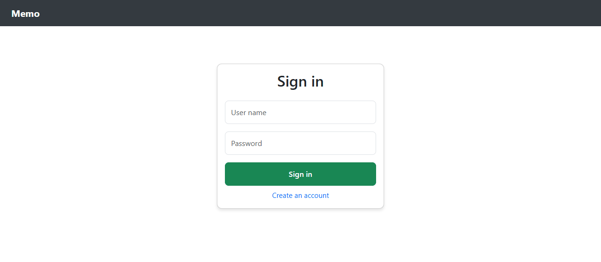
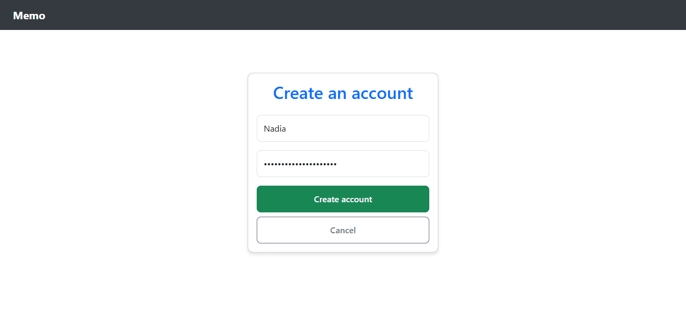
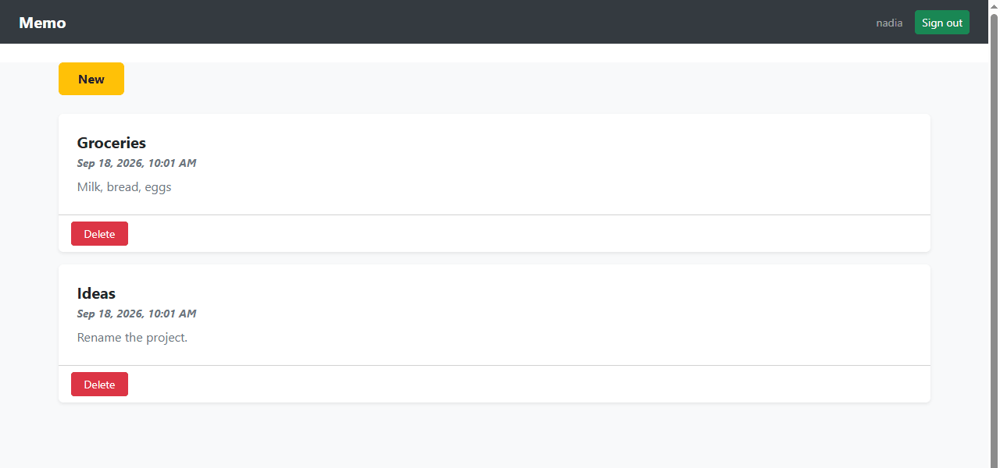
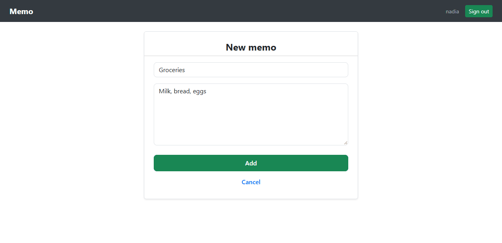
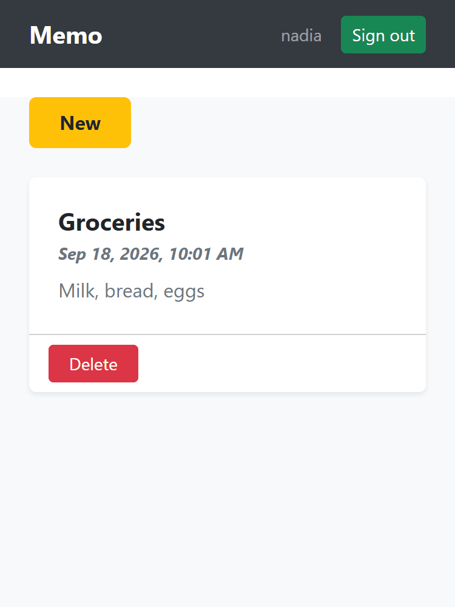

# memo-board

[](https://github.com/Arthure-code/memo-board/actions/workflows/build.yml)
[](https://sonarcloud.io/summary/new_code?id=Arthure-code_memo-board)
[](https://sonarcloud.io/summary/new_code?id=Arthure-code_memo-board)
[](https://sonarcloud.io/summary/new_code?id=Arthure-code_memo-board)
[](https://sonarcloud.io/summary/new_code?id=Arthure-code_memo-board)
[](https://sonarcloud.io/summary/new_code?id=Arthure-code_memo-board)
[](https://sonarcloud.io/summary/new_code?id=Arthure-code_memo-board)
[](https://sonarcloud.io/summary/new_code?id=Arthure-code_memo-board)

Private memos behind a sign-in. Open an account, sign in, write memos,
delete them; nobody else sees them, not even with the address of one.
The API keeps only a hash of each password, answers every sign-in
failure the same way, counts attempts, and issues a signed token that
names the account; every memo route requires that token and acts only
on the memos of the account it names.

Two projects in one repository: `api`, an ASP.NET Core 8 Web API in
three layers (Core, Infrastructure, Api) on Entity Framework Core and
SQLite, and `web`, an Angular 21 application with Bootstrap and
ngx-toastr.

## Screenshots











## How it works

**Passwords are hashed, never stored.** `AccountService` runs the
password through ASP.NET Core's `PasswordHasher`, PBKDF2 with a salt, and
keeps the result; signing in verifies the hash. A wrong name and a wrong
password get the same 401 and the same sentence, so the API cannot be
used to list accounts. Names are stored in lower case and unique, and
the database enforces it with an index.

**Five attempts a minute.** The login route sits behind the built-in
rate limiter, a fixed window per client address; the sixth attempt in a
minute is a 429. The limit is configuration (`RateLimiting`), and the
tests lower it to prove it.

**A token names the account.** A successful sign-in returns a JWT signed
with HMAC-SHA256, carrying the account id and name, valid for an hour.
The key comes from configuration and never from the repository: user
secrets or an environment variable while developing, a vault in
production. Without one, a development run generates a key for the
process and a production run refuses to start.

**Least privilege on every memo route.** `MemosController` is
`[Authorize]`; the account id is read from the token, never from a
header or the body. `MemoService` lists, creates and deletes for that id
only. Deleting a memo that belongs to someone else answers 404, the same
as a memo that does not exist: the caller learns nothing. A title is
unique per account, enforced by the service and by an index.

**The client trusts nothing it did not get from the API.** `SessionService`
keeps the session in `sessionStorage`, which dies with the tab, and
drops it once the token has expired. `authInterceptor` attaches the
bearer token to every call and, when the API refuses one, ends the
session and returns to the sign-in page. `authGuard` keeps the memo
pages for signed-in visitors. Titles and texts are rendered as text,
never as HTML.

**Hardening headers on every answer.** `X-Content-Type-Options: nosniff`,
`X-Frame-Options: DENY`, `Referrer-Policy: no-referrer` and
`Cache-Control: no-store`, so a token or a memo is never cached or
framed. CORS accepts the front end only. HTTPS redirection is on.

**Three layers, one door to the database.** Core holds the entities,
the request and answer types with their validation attributes, the
service contracts and the services; Infrastructure holds the
`DbContext`, the migration and the generic `AsyncRepository<T>` that is
the only class touching the database; Api holds the controllers, the
token service and the pipeline. Core knows nothing of HTTP or EF Core.

## Running it

The API, from `api/MemoBoard.Api`:

```bash
dotnet run --launch-profile http
```

It listens on `http://localhost:5047`, creates `memos.db` from the
migration on first start and serves Swagger at `/swagger`. To keep the
same signing key between runs while developing:

```bash
dotnet user-secrets set "Jwt:Key" "a long random string of at least 32 characters"
```

The web app, from `web`:

```bash
npm install
npm start
```

Open `http://localhost:4200/`, create an account, sign in.

## Tests

From `api`:

```bash
dotnet test
```

Nineteen xUnit tests through HTTP on the real pipeline, the database
swapped for SQLite in memory: registration and its validation, the
same 401 for a wrong name and a wrong password, the token that opens
the memos, the sixth attempt refused, the hardening headers; then, with
two accounts each carrying its own token, that nothing works without a
token, that a forged one is refused, that each account sees only its
memos, that a title is unique per account and free for another, and that
deleting someone else's memo answers 404 and leaves it there.

From `web`:

```bash
npm test
```

Twenty-five Vitest tests through `TestBed`, as the Angular guides show:
the session service against `HttpTestingController` and
`sessionStorage`, the interceptor adding the token and ending the
session on a 401, the guard, the error messages, and the three pages
with the services replaced by stubs. `npm run lint` runs angular-eslint,
`npm run coverage` writes the lcov report that the workflow, with the
OpenCover report of `dotnet test`, hands to SonarCloud.

## Stack

ASP.NET Core 8 Web API, Entity Framework Core 8 with SQLite and a
migration, `PasswordHasher`, JWT bearer authentication, the built-in rate
limiter, xUnit with `WebApplicationFactory`. Angular 21 with standalone
components, signals, functional guard and interceptor, template forms,
ngx-toastr 20 (no animations module needed); Bootstrap 5.3 through npm,
only the parts the pages use; Vitest.

## Résumé

Des mémos privés derrière une connexion : on ouvre un compte, on se
connecte, on écrit des mémos, on les supprime ; personne d'autre ne les
voit, même avec l'adresse de l'un d'eux. L'API ne garde qu'un hachage du
mot de passe (PBKDF2 salé), répond la même chose à un nom inconnu et à un
mauvais mot de passe, limite les tentatives à cinq par minute et émet un
jeton signé qui nomme le compte ; chaque route des mémos exige ce jeton
et n'agit que sur les mémos de ce compte, supprimer celui d'un autre
répond 404 comme s'il n'existait pas. Trois couches côté API, un seul
dépôt générique qui touche la base ; côté Angular, un intercepteur qui
porte le jeton et ferme la session dès que l'API le refuse, un garde sur
les pages. Dix-neuf tests xUnit et vingt-cinq tests Vitest.

## Licence

MIT. See [LICENSE](LICENSE).
